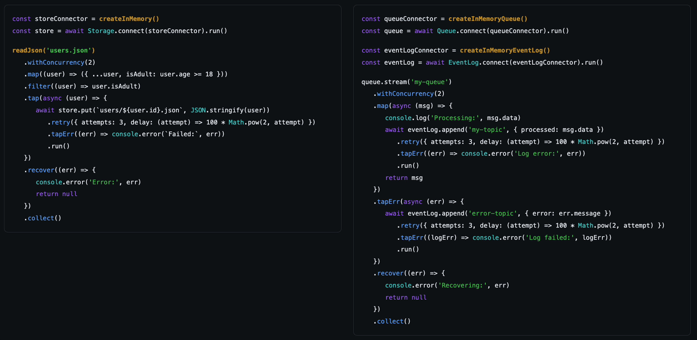

# Anabranch

A TypeScript monorepo for async utilities with first-class error handling.
Compatible with Deno, Node.js, and, occasionally, browsers.



## Adapters

Anabranch provides adapters for popular tools like Kafka, S3, RabbitMQ,
PostgreSQL, MySQL, SQLite, and Google Cloud Storage out of the box. These
adapters wrap common operations in Anabranch semantics (Streams and Tasks),
making them instantly interchangeable. This is especially useful for testing
with in-memory adapters.

What do you do if your use case isn't covered by an existing adapter?

### Simple wrapping

For straightforward cases, wrap promises or async iterables directly:

```ts
import { Source, Task } from 'anabranch'

// From an async iterable
const stream = Source.from(myAsyncIterable())

// From a promise
const task = Task.of(() => fetchData())
```

### Custom adapters

For integration with abstractions like `Storage`, and the interchangeability it
brings, create a custom connector that produces adapters:

```ts
import type { StorageAdapter, StorageConnector } from '@anabranch/storage'
import { Storage } from '@anabranch/storage'

// 1. Implement the adapter interface
const myAdapter: StorageAdapter = {
  async put(key, body) {/* ... */},
  async get(key) {/* ... */},
  async delete(key) {/* ... */},
  async head(key) {/* ... */},
  async *list(prefix) {/* ... */},
  async close() {/* ... */},
}

// 2. Create a connector that produces adapters
function createMyStorage(): StorageConnector {
  return {
    connect() {
      return Promise.resolve(myAdapter)
    },
    end() {/* cleanup */},
  }
}

// 3. Use with the Storage wrapper for Task/Stream semantics
const storage = await Storage.connect(createMyStorage()).run()
await storage.put('file.txt', 'hello').run()
```

This pattern is consistent across all Anabranch adapters.

## Scripts

```bash
# Bootstrap a new package
deno run -A scripts/bootstrap.ts new-package

# Bump versions (dry-run first)
deno run --allow-read --allow-write scripts/bump.ts --help

# Run checks
deno task check
```

## Packages

<!-- PACKAGES START -->

| Package                                               | Description                                                                                                                                 | JSR                                                                                                        | npm                                                                                                                                  |
| ----------------------------------------------------- | ------------------------------------------------------------------------------------------------------------------------------------------- | ---------------------------------------------------------------------------------------------------------- | ------------------------------------------------------------------------------------------------------------------------------------ |
| [anabranch](./packages/anabranch)                     | Async stream processing where errors are collected alongside values instead of stopping the pipeline. Built on Task and Channel primitives. | [](https://jsr.io/@anabranch/anabranch)                     | [](https://www.npmjs.com/package/anabranch)                                           |
| [broken-link-checker](./packages/broken-link-checker) | Crawl websites and find broken links. Uses web-client for robust HTTP and anabranch streams for concurrent processing with backpressure.    | [](https://jsr.io/@anabranch/broken-link-checker) | [](https://www.npmjs.com/package/@anabranch/broken-link-checker) |
| [cache](./packages/cache)                             | Cache primitives with Task semantics for composable error handling                                                                          | [](https://jsr.io/@anabranch/cache)                             | [](https://www.npmjs.com/package/@anabranch/cache)                             |
| [cache-redis](./packages/cache-redis)                 | Redis adapter for @anabranch/cache using ioredis with native TTL support                                                                    | [](https://jsr.io/@anabranch/cache-redis)                 | [](https://www.npmjs.com/package/@anabranch/cache-redis)                 |
| [check-runs](./packages/check-runs)                   | CI status reporting with line annotations. Report tests, lints, builds with error locations.                                                | [](https://jsr.io/@anabranch/check-runs)                   | [](https://www.npmjs.com/package/@anabranch/check-runs)                   |
| [check-runs-github](./packages/check-runs-github)     | GitHub API implementation for @anabranch/check-runs                                                                                         | [](https://jsr.io/@anabranch/check-runs-github)     | [](https://www.npmjs.com/package/@anabranch/check-runs-github)     |
| [db](./packages/db)                                   | Database abstraction with Task/Stream semantics. In-memory adapter for testing, adapters for PostgreSQL, MySQL, and SQLite.                 | [](https://jsr.io/@anabranch/db)                                   | [](https://www.npmjs.com/package/@anabranch/db)                                   |
| [db-mysql](./packages/db-mysql)                       | MySQL database connector using mysql2 with connection pooling for MySQL databases.                                                          | [](https://jsr.io/@anabranch/db-mysql)                       | [](https://www.npmjs.com/package/@anabranch/db-mysql)                       |
| [db-postgres](./packages/db-postgres)                 | PostgreSQL database connector using node:pg with connection pooling and cursor-based streaming for large result sets.                       | [](https://jsr.io/@anabranch/db-postgres)                 | [](https://www.npmjs.com/package/@anabranch/db-postgres)                 |
| [db-sqlite](./packages/db-sqlite)                     | SQLite database connector using Node.js built-in node:sqlite for in-memory or file-based databases.                                         | [](https://jsr.io/@anabranch/db-sqlite)                     | [](https://www.npmjs.com/package/@anabranch/db-sqlite)                     |
| [eventlog](./packages/eventlog)                       | Event log with Task/Stream semantics. In-memory adapter for event-sourced systems with cursor-based consumption.                            | [](https://jsr.io/@anabranch/eventlog)                       | [](https://www.npmjs.com/package/@anabranch/eventlog)                       |
| [eventlog-kafka](./packages/eventlog-kafka)           | Kafka adapter for eventlog using kafkajs with Task/Stream semantics                                                                         | [](https://jsr.io/@anabranch/eventlog-kafka)           | [](https://www.npmjs.com/package/@anabranch/eventlog-kafka)           |
| [fs](./packages/fs)                                   | Streaming file-system utilities for reading, walking, globbing, and watching files with composable error handling.                          | [](https://jsr.io/@anabranch/fs)                                   | [](https://www.npmjs.com/package/@anabranch/fs)                                   |
| [nosql](./packages/nosql)                             | NoSQL document collection primitives with Task/Stream semantics                                                                             | [](https://jsr.io/@anabranch/nosql)                             | [](https://www.npmjs.com/package/@anabranch/nosql)                             |
| [queue](./packages/queue)                             | Message queue with Task/Stream semantics. In-memory adapter with delayed messages, dead letter queues, and visibility timeout.              | [](https://jsr.io/@anabranch/queue)                             | [](https://www.npmjs.com/package/@anabranch/queue)                             |
| [queue-rabbitmq](./packages/queue-rabbitmq)           | RabbitMQ adapter for @anabranch/queue using amqplib. Supports all queue features with RabbitMQ queues for persistent messaging.             | [](https://jsr.io/@anabranch/queue-rabbitmq)           | [](https://www.npmjs.com/package/@anabranch/queue-rabbitmq)           |
| [queue-redis](./packages/queue-redis)                 | Redis adapter for @anabranch/queue using ioredis. Supports all queue features with Redis streams for persistent messaging.                  | [](https://jsr.io/@anabranch/queue-redis)                 | [](https://www.npmjs.com/package/@anabranch/queue-redis)                 |
| [storage](./packages/storage)                         | Object storage primitives with Task/Stream semantics. In-memory adapter with generic interface for cloud providers.                         | [](https://jsr.io/@anabranch/storage)                         | [](https://www.npmjs.com/package/@anabranch/storage)                         |
| [storage-browser](./packages/storage-browser)         | Browser storage adapter using IndexedDB. Works in browsers and Web Workers.                                                                 | [](https://jsr.io/@anabranch/storage-browser)         | [](https://www.npmjs.com/package/@anabranch/storage-browser)         |
| [storage-gcs](./packages/storage-gcs)                 | GCS adapter for @anabranch/storage using @google-cloud/storage. Supports signed URLs and all storage operations.                            | [](https://jsr.io/@anabranch/storage-gcs)                 | [](https://www.npmjs.com/package/@anabranch/storage-gcs)                 |
| [storage-s3](./packages/storage-s3)                   | S3 adapter for @anabranch/storage using @aws-sdk/client-s3. Supports presigned URLs, multipart uploads, and all storage operations.         | [](https://jsr.io/@anabranch/storage-s3)                   | [](https://www.npmjs.com/package/@anabranch/storage-s3)                   |
| [web-client](./packages/web-client)                   | Modern HTTP client built on fetch with automatic retries, timeouts, and rate-limit handling. Returns Task for composable error handling.    | [](https://jsr.io/@anabranch/web-client)                   | [](https://www.npmjs.com/package/@anabranch/web-client)                   |

<!-- PACKAGES END -->
